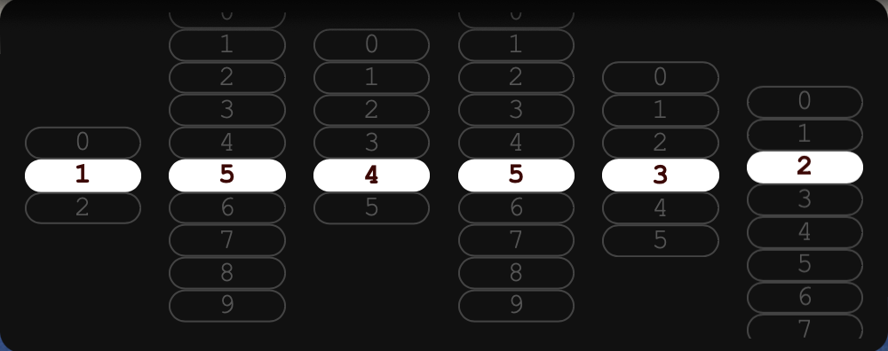

# Scrolling Clock Widget

An animated desktop clock widget for [Übersicht](https://tracesof.net/uebersicht/). Each digit of the time (HH:MM:SS) scrolls smoothly into place in its own column.



## Installation

1. Install [Übersicht](https://tracesof.net/uebersicht/)
2. Download `scrolling-clock.widget.zip` from this repo
3. Unzip and move the `scrolling-clock.widget` folder to your Übersicht widgets folder:
   ```bash
   mv scrolling-clock.widget ~/Library/Application\ Support/Übersicht/widgets/
   ```

## Customization

Edit `clock.jsx` and modify the `className` export to change position and size.

## License

MIT
